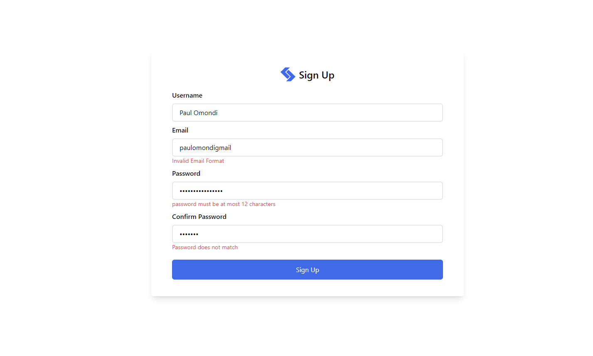

## SignUp Form Validation With React Hook Form

### Project Overview

This project demonstrates the creation of a user-friendly sign-up form utilizing modern web development technologies. The form is styled with Tailwind CSS for a clean and responsive design, while React Hook Form is employed to manage form state and validation. Additionally, Yup is integrated for schema-based form validation.

### Technologies Used

[React](https://react.dev/) A JavaScript library for building user interfaces

[Tailwind Css](https://tailwindcss.com/) A utility-first CSS framework for rapid UI development

[React Hook Form](https://www.react-hook-form.com/get-started) A library for managing form state and validation in React applications.

[Yup](https://github.com/jquense/yup?tab=readme-ov-file) A JavaScript schema builder for value parsing and validation.

### Installation and Setup

1. Clone Repository

`git clone https://github.com/your-username/your-repo-name.git `

2. Navigate to project directory

`cd your-repo-name`

3. Install Dependencies

`npm install`

4. Start development server

`npm run dev`
